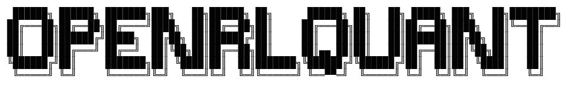

<div align="center">



**Reinforcement Learning for Quantitative US Equity Trading**

*From raw market data to autonomous live execution — in four phases.*

[](https://python.org)
[](https://pytorch.org)
[](https://stable-baselines3.readthedocs.io)
[](https://gymnasium.farama.org)
[](LICENSE)
[](https://github.com/yourusername/OpenRLQuant/stargazers)

</div>

---

## What is OpenRLQuant?

OpenRLQuant is a **production-grade reinforcement learning framework for quantitative US equity trading**. It covers the full lifecycle from raw market data to live autonomous execution, with a multi-layer risk management system throughout.

Most RL-trading repositories show you a toy environment with 1 stock and no transaction costs. OpenRLQuant is built differently:

- **Real market simulation** — adjusted OHLCV, realistic slippage, market impact, PDT rules
- **Multi-asset portfolio** — trade 5–20 stocks simultaneously with continuous weight allocation
- **Transformer policy** — temporal encoder per stock + cross-asset attention for correlation modeling
- **Curriculum learning** — progress from calm bull markets to full crisis scenarios
- **Live execution** — Alpaca API integration, paper and live trading modes
- **Production MLOps** — drift detection, auto-retraining, ensemble voting, Prometheus/Grafana monitoring

---

## Architecture

```
┌─────────────────────────────────────────────────────────────────────┐
│                         OpenRLQuant                                 │
│                                                                     │
│  Phase 1: Data & Features          Phase 2: RL Training             │
│  ┌─────────────────────────┐       ┌─────────────────────────┐      │
│  │ MarketDataLoader        │       │ PPO + MLP / Transformer │      │
│  │  Polygon.io / Yahoo     │       │ Curriculum Learning     │      │
│  │  Finnhub News (NLP)     │  ───► │ Walk-Forward Validation │      │
│  │  88 Technical Features  │       │ Optuna Hyperopt         │      │
│  │  Macro / VIX Regime     │       │ Champion/Challenger     │      │
│  └─────────────────────────┘       └─────────────────────────┘      │
│                                              │                      │
│  Phase 4: Autonomous Ops           Phase 3: Live Execution          │
│  ┌─────────────────────────┐       ┌─────────────────────────┐      │
│  │ Auto-Retraining         │       │ Alpaca Broker API       │      │
│  │ Ensemble (UCB1 / Vote)  │  ◄─── │ Multi-Layer Risk Mgr    │      │
│  │ Drift Detection (CUSUM) │       │ FastAPI Inference Server│      │
│  │ Scheduler (APScheduler) │       │ Prometheus + Grafana    │      │
│  │ Slack / Email Alerts    │       │ Docker Compose Deploy   │      │
│  └─────────────────────────┘       └─────────────────────────┘      │
└─────────────────────────────────────────────────────────────────────┘
```

---

## Key Features

### 🧠 Transformer Policy Network
Per-stock temporal encoder with CLS token aggregation, followed by cross-asset multi-head attention. The agent learns inter-stock correlations (e.g., NVDA↑ → AMD↑) implicitly, without hardcoded rules.

```python
# Swap between MLP (fast baseline) and Transformer (production)
policy_kwargs = make_transformer_policy_kwargs(
    n_stocks=8, n_features=88, lookback=60,
    d_model=128, n_heads=4, n_transformer_layers=2,
)
model = PPO("MlpPolicy", env, policy_kwargs=policy_kwargs)
```

### 📈 Realistic Environment
```python
env = TradingEnv(
    feature_store=feature_store,
    symbols=["AAPL", "MSFT", "NVDA", "JPM", "JNJ"],
    initial_capital=1_000_000,
    transaction_cost_bps=5.0,    # commission
    slippage_bps=3.0,            # bid-ask spread
    market_impact_factor=0.1,    # sqrt(size/ADV) impact
    reward_type="sharpe",        # risk-adjusted reward
    max_position_pct=0.10,       # 10% per stock cap
)
```

### 🛡️ Multi-Layer Risk Management
```
Layer 1: Portfolio drawdown halt  — >15% total DD → liquidate all
Layer 2: Daily drawdown halt      — >8% intraday DD → stop today
Layer 3: VIX regime scaling       — VIX>30 → 60% pos, VIX>40 → 30%
Layer 4: Single stock cap         — max 10% NAV per position
Layer 5: Sector concentration     — max 30% per sector
Layer 6: Liquidity filter         — max 1% of ADV per order
Layer 7: Kelly criterion sizing   — 25% fractional Kelly
```

### 🔄 Champion / Challenger Retraining
```python
# Statistically rigorous model promotion via Welch's t-test
pipeline = RetrainingPipeline(
    symbols=symbols,
    config=RetrainConfig(
        min_sharpe_absolute=0.3,      # new model gate
        min_sharpe_improvement=0.05,  # must beat old by this margin
        confidence_level=0.10,        # one-tailed t-test α
    )
)
# Triggered weekly by scheduler, or immediately on drift detection
```

---

## Quickstart

```bash
# 1. Clone & install
git clone https://github.com/yourusername/OpenRLQuant.git
cd OpenRLQuant
python -m venv .venv && source .venv/bin/activate
pip install -r requirements.txt

# 2. Configure API keys (all free tiers available)
cp .env.example .env
# Fill in: POLYGON_API_KEY, FINNHUB_KEY, ALPACA_API_KEY

# 3. Phase 1 — validate data pipeline
python run_phase1.py --mode quick

# 4. Phase 2 — train PPO agent (~30 min on CPU)
python run_phase2.py --mode mlp --use-synthetic \
    --n-stocks 5 --timesteps 500000

# 5. Phase 4 — launch full autonomous system
python run_phase4.py --mode paper --dry-run \
    --model-path models/ppo_mlp_final
```

---

## Four-Phase Architecture

| Phase | Entry Point | What it builds | Key modules |
|-------|-------------|----------------|-------------|
| **1** | `run_phase1.py` | Data pipeline, feature engineering, Gymnasium env | `data/`, `features/`, `environment/` |
| **2** | `run_phase2.py` | PPO training, Transformer policy, curriculum, hyperopt | `train/` |
| **3** | `run_phase3.py` | Live execution, FastAPI server, monitoring, Docker | `execution/`, `monitoring/`, `deployment/` |
| **4** | `run_phase4.py` | Auto-retraining, ensemble voting, scheduling, alerts | `automation/`, `ensemble/` |

---

## Project Structure

```
OpenRLQuant/
│
├── config/
│   └── settings.py              # All hyperparameters centralized
│
├── data/
│   ├── market_data.py           # Polygon.io / Yahoo Finance / Finnhub ingestion
│   └── universe_screener.py     # Liquidity & quality filtering
│
├── features/
│   └── feature_engineer.py      # 88 features: technical + macro + NLP sentiment
│
├── environment/
│   ├── trading_env.py           # Gymnasium multi-asset trading environment
│   └── backtester.py            # Walk-forward validation, performance metrics
│
├── train/
│   ├── policy_network.py        # Transformer encoder + cross-asset attention
│   ├── train_ppo.py             # Training modes: MLP / Transformer / Curriculum
│   ├── curriculum.py            # 4-stage progressive difficulty scheduler
│   ├── callbacks.py             # Eval, checkpoint, early stopping callbacks
│   └── hyperopt.py              # Optuna TPE search over 12 dimensions
│
├── execution/
│   ├── broker.py                # PaperBroker + AlpacaBroker (unified interface)
│   └── engine.py                # Real-time trading loop
│
├── monitoring/
│   ├── drift_detector.py        # CUSUM + KS-test model drift detection
│   └── metrics_exporter.py      # Prometheus metrics + Grafana dashboard JSON
│
├── automation/
│   ├── retrain_pipeline.py      # Champion/Challenger with Welch's t-test
│   ├── alerts.py                # Slack + Email + Webhook notifications
│   └── scheduler.py             # 7 scheduled jobs (APScheduler)
│
├── ensemble/
│   └── ensemble_agent.py        # Weighted / UCB1 / Disagreement-aware voting
│
├── deployment/
│   ├── api_server.py            # FastAPI: 15 REST endpoints
│   ├── docker-compose.yml       # Trader + Prometheus + Grafana + Redis
│   └── Dockerfile
│
├── utils/
│   ├── helpers.py               # Plotting, regime detection, portfolio analytics
│   ├── risk_manager.py          # 7-layer hard risk constraint engine
│   └── experiment_tracker.py    # MLflow wrapper with CSV fallback
│
├── notebooks/
│   └── phase1_analysis.ipynb    # EDA, feature visualization, baseline backtest
│
├── docs/
│   ├── project_homepage.html    # Visual project homepage (GitHub Pages ready)
│   └── GITHUB_CONFIG.yml        # Issue templates, labels, PR template
│
├── tests/
│   └── test_all.py
│
├── .env.example                 # API key template (Polygon, Finnhub, Alpaca)
├── .gitignore
├── CONTRIBUTING.md
├── LICENSE
├── README.md
├── requirements.txt
├── run_phase1.py                # Phase 1: data pipeline validation
├── run_phase2.py                # Phase 2: PPO training
├── run_phase3.py                # Phase 3: live execution
└── run_phase4.py                # Phase 4: full autonomous system
```

---

## Performance Targets

| Metric | Target | Benchmark (SPY B&H) |
|--------|--------|---------------------|
| Annual Return | > 20% | ~12% |
| Sharpe Ratio | > 1.2 | ~0.7 |
| Max Drawdown | < 15% | ~34% (2022) |
| Calmar Ratio | > 1.5 | ~0.35 |
| Alpha vs SPY | > 8%/yr | — |

> ⚠️ Targets are aspirational. Past backtest performance does not guarantee future live results. Always paper trade first.

---

## Monitoring Dashboard

Once running, access:

| Service | URL | Purpose |
|---------|-----|---------|
| FastAPI Docs | `http://localhost:8000/docs` | 15 REST endpoints |
| Live Status | `http://localhost:8000/status` | P&L, positions, risk |
| Grafana | `http://localhost:3000` | Real-time charts |
| Prometheus | `http://localhost:9091` | Raw metrics |

```bash
# One-command production stack
docker compose -f deployment/docker-compose.yml up -d
```

---

## Roadmap

- [ ] **Factor research** — Barra-style quality, value, momentum factors
- [ ] **Options overlay** — protective puts for tail risk hedging
- [ ] **Alternative data** — earnings call NLP, satellite imagery signals
- [ ] **Multi-timeframe** — daily signal + intraday VWAP execution
- [ ] **Regime detection** — HMM-based market regime classifier
- [ ] **SAC / TD3** — off-policy algorithms for sample efficiency
- [ ] **Dreamer V3** — world model for low-data regime learning
- [ ] **Web UI** — real-time dashboard without Grafana dependency

---

## Important Disclaimers

> **This project is for educational and research purposes only.**
>
> - Backtested performance is not indicative of future results
> - US equity trading involves substantial risk of loss
> - Always paper trade for at least 3 months before using real capital
> - Ensure compliance with SEC regulations and your broker's terms of service
> - The authors assume no liability for financial losses of any kind

---

## Contributing

Contributions are welcome. Please open an issue first to discuss what you'd like to change.

```bash
# Development setup
git clone https://github.com/yourusername/OpenRLQuant.git
cd OpenRLQuant
pip install -r requirements.txt
python -m pytest tests/ -v
```

See [CONTRIBUTING.md](CONTRIBUTING.md) for detailed guidelines.

---

## License

MIT License — see [LICENSE](LICENSE) for details.

---

<div align="center">

**Built with PyTorch · Stable-Baselines3 · Gymnasium · FastAPI · Alpaca**

*If this project helped you, consider giving it a ⭐*

</div>